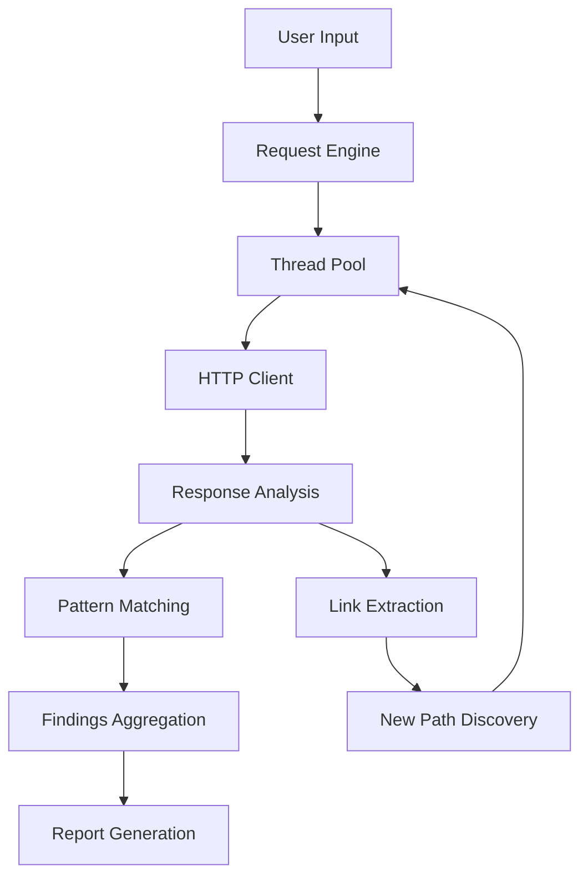

<p align="center">
  
</p>

<h2 align="center">ＡＮＯＭＡＬＹＺＥ</h2>

<p align="center">
  <b>Detect anomalous server behaviors and potential vulnerabilities through customized HTTP request testing and response analysis.</b>
</p>

<p align="center">
  
  
  
  
</p>

### Anomalyze 🔍


## Table of Contents
- [Overview](#overview)
- [Key Features](#key-features)
- [Installation Guide](#installation-guide)
- [Usage Documentation](#usage-documentation)
  - [Basic Usage](#basic-usage)
  - [Advanced Options](#advanced-options)
  - [Practical Examples](#practical-examples)
- [Output Formats](#output-formats)
- [Technical Architecture](#technical-architecture)
- [Contributing Guidelines](#contributing-guidelines)
- [License Information](#license-information)
- [Support and Contact](#support-and-contact)

## Overview

Anomalyze is a sophisticated security analysis tool designed for penetration testers, security researchers, and web developers. It performs comprehensive scanning of web applications to identify:

- Sensitive data exposure
- Hidden API endpoints
- Authentication vulnerabilities
- Information disclosure issues
- Server misconfigurations

The tool combines traditional directory brute-forcing with intelligent response analysis, making it significantly more effective than conventional scanners.

## Key Features

### 1. Comprehensive Path Discovery
- Built-in dictionary of 500+ common paths
- Custom path input support
- Recursive path discovery from:
  - HTML links
  - JavaScript files
  - JSON responses
  - Comments and metadata

### 2. Advanced Response Analysis
- **Content Inspection**:
  - Credit card patterns
  - API keys and tokens
  - Credential patterns
  - PII (Personally Identifiable Information)
  
- **Header Analysis**:
  - Security header checks
  - Server information leaks
  - Session handling issues

### 3. Performance Optimizations
- Multi-threaded architecture (configurable thread count)
- Connection pooling
- Intelligent rate limiting
- Persistent sessions

### 4. Reporting Capabilities
- JSON output for integration with other tools
- CSV for spreadsheet analysis
- Color-coded console output
- Severity classification (Critical, High, Medium, Low, Info)

## Installation Guide

### Prerequisites
- Python 3.8+
- pip 20.0+
- Recommended: Virtual environment

### Installation Methods

#### Method 1: From Source
```bash
git clone https://github.com/xtawb/Anomalyze.git
cd Anomalyze
python -m venv venv
source venv/bin/activate  # Linux/MacOS
# venv\Scripts\activate  # Windows
pip3 install -r requirements.txt
```

### Verification
```bash
python3 Anomalyze.py --help
```

## Usage Documentation

### Basic Usage
```bash
python3 Anomalyze.py -u https://target.site
```

### Advanced Options

#### Scan Configuration
| Option               | Description                                  | Default |
|----------------------|----------------------------------------------|---------|
| `-u, --url`          | Base URL to scan                             | None    |
| `-p, --path`         | Add custom path(s) to scan                   | None    |
| `--paths-file`       | File containing paths to test                | None    |
| `--default-paths`    | Enable built-in path dictionary              | False   |
| `--deep-scan`        | Enable recursive link following              | False   |
| `--max-depth`        | Maximum recursion depth                      | 2       |

#### Request Configuration
| Option               | Description                                  | Default |
|----------------------|----------------------------------------------|---------|
| `-m, --method`       | HTTP method to use                           | GET     |
| `-H, --header`       | Add custom headers                           | None    |
| `-d, --data`         | Request body data                            | None    |
| `--params`           | Add query parameters                         | None    |
| `--cookie`           | Set cookie values                            | None    |
| `--user-agent`       | Custom User-Agent string                     | Random  |

#### Performance Options
| Option               | Description                                  | Default |
|----------------------|----------------------------------------------|---------|
| `-t, --threads`      | Number of concurrent threads                 | 10      |
| `-x, --proxy`        | Proxy server to use                          | None    |
| `--timeout`          | Request timeout in seconds                   | 15      |
| `--delay`            | Delay between requests (ms)                  | 0       |


<p align="center">
  
</p>


### Practical Examples

#### Example 1: Basic Vulnerability Scan
```bash
python3 Anomalyze.py -u https://example.com --default-paths -t 20 -o both
```

#### Example 2: Authenticated Scan
```bash
python3 Anomalyze.py -u https://example.com -H "Authorization: Bearer token123" --deep-scan
```

#### Example 3: API Testing
```bash
python3 Anomalyze.py -u https://api.example.com/v1 -m POST --data '{"query":"test"}' -H "Content-Type: application/json"
```

## Output Formats

### Console Output
Color-coded results with severity indicators:
- 🔴 Critical
- 🟠 High
- 🟡 Medium
- 🔵 Low
- ⓘ Info

### JSON Report
```json
{
  "url": "https://example.com/admin",
  "status": 200,
  "findings": [
    {
      "type": "API Key",
      "match": "api_key=12345",
      "severity": "Critical",
      "location": "body"
    }
  ]
}
```

### CSV Report
```
URL,Status,Size,Time,Severity,Finding Type,Match,Location
https://example.com/admin,200,1024,0.45s,Critical,API Key,api_key=12345,body
```

## Technical Architecture




<p align="center">
  
</p>


## Contributing Guidelines

### Code Contributions
1. Fork the repository
2. Create a feature branch (`git checkout -b feature/your-feature`)
3. Commit your changes (`git commit -am 'Add some feature'`)
4. Push to the branch (`git push origin feature/your-feature`)
5. Open a Pull Request

### Testing Requirements
- All new features must include:
  - Unit tests
  - Integration tests
  - Documentation updates

### Style Guide
- Follow PEP 8 guidelines
- Type hints for all new code
- Docstrings for all public methods

## License Information

MIT License

Copyright (c) 2025 xtawb

Permission is hereby granted... [include full license text]

## Support and Contact

For support, questions, or security disclosures:
- Email: security@xtawb.io
- GitHub Issues: https://github.com/xtawb/Anomalyze/issues
- Documentation: https://anomalyze.readthedocs.io

## Frequently Asked Questions

**Q: How is this different from dirbuster/gobuster?**
A: Anomalyze goes beyond simple directory brute-forcing by analyzing responses for sensitive data and automatically discovering new paths.

**Q: Is this tool safe to run on production systems?**
A: Always get proper authorization before scanning any system. The tool includes rate limiting to reduce impact.

**Q: Can I extend the pattern matching?**
A: Yes, the `patterns.json` file can be modified to add new detection rules.
