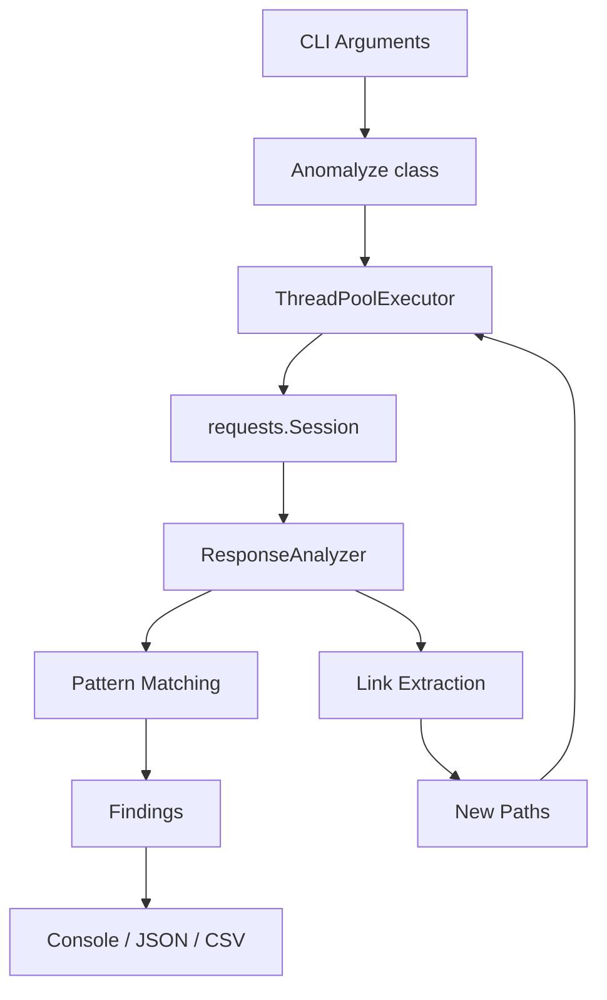

<p align="center">
  
</p>

<h2 align="center">ＡＮＯＭＡＬＹＺＥ</h2>

<p align="center">
  <b>Detect anomalous server behaviors and potential vulnerabilities through customized HTTP request testing and response analysis.</b>
</p>

<p align="center">
  
  
  
  
</p>

### Anomalyze 🔍


## Table of Contents
- [Overview](#overview)
- [Key Features](#key-features)
- [Installation Guide](#installation-guide)
- [Usage Documentation](#usage-documentation)
  - [Basic Usage](#basic-usage)
  - [Advanced Options](#advanced-options)
  - [Practical Examples](#practical-examples)
- [Output Formats](#output-formats)
- [Technical Architecture](#technical-architecture)
- [Testing](#testing)
- [Contributing Guidelines](#contributing-guidelines)
- [License Information](#license-information)
- [Support and Contact](#support-and-contact)

## Overview

Anomalyze is a security analysis tool for penetration testers, security
researchers, and web developers, built for **authorized** testing of web
applications you own or have explicit permission to assess. It performs
comprehensive scanning of web applications to identify:

- Sensitive data exposure
- Hidden API endpoints
- Authentication vulnerabilities
- Information disclosure issues
- Server misconfigurations

The tool combines traditional directory brute-forcing with intelligent
response analysis, making it significantly more effective than conventional
scanners.

## Key Features

### 1. Comprehensive Path Discovery
- Built-in dictionary of common paths, or bring your own via `--paths-file`
- Custom path input support (`-p/--path`, repeatable)
- Recursive path discovery from HTML links, `<script>` tags, and JSON
  responses, opt-in via `--deep-scan` and bounded by `--max-depth`

### 2. Advanced Response Analysis
- **Content Inspection**:
  - Credit card patterns
  - API keys and tokens
  - Credential patterns
  - PII (Personally Identifiable Information)

- **Header Analysis**:
  - Security header checks
  - Server/tech-stack information leaks
  - Matches header *values*, not header names, to avoid false positives from
    routine headers like `Server` or `Authorization`

- **Custom Patterns**: sensitive-data rules live in `patterns.json` and can
  be overridden with `--patterns-file`

### 3. Performance Optimizations
- Multi-threaded architecture (configurable via `-t/--threads`)
- Persistent, connection-pooled `requests` session
- Configurable delay/backoff via `--delay` (fixed ms or `random(min-max)`)
- Content-type and size guards skip binary/oversized responses

### 4. Reporting Capabilities
- JSON output for integration with other tools
- CSV for spreadsheet analysis
- Color-coded console output
- Severity classification (Critical, High, Medium, Low, Info), with
  `--min-severity` to filter the noise floor

## Installation Guide

### Prerequisites
- Python 3.8+
- pip 20.0+
- Recommended: Virtual environment

### Installation Methods

#### Method 1: From Source
```bash
git clone https://github.com/xtawb/Anomalyze.git
cd Anomalyze
python -m venv venv
source venv/bin/activate  # Linux/MacOS
# venv\Scripts\activate  # Windows
pip3 install -r requirements.txt
```

### Verification
```bash
python3 Anomalyze.py --help
python3 Anomalyze.py --version
```

## Usage Documentation

### Basic Usage
```bash
python3 Anomalyze.py -u https://target.site
```

### Advanced Options

#### Scan Configuration
| Option               | Description                                  | Default |
|----------------------|----------------------------------------------|---------|
| `-u, --url`          | Base URL to scan                             | *required* |
| `-p, --path`         | Add custom path(s) to scan                   | None    |
| `--paths-file`       | File containing paths to test                | None    |
| `--default-paths`    | Enable built-in path dictionary              | Used automatically if no paths given |
| `--deep-scan`        | Follow links found in responses to discover new paths | False |
| `--max-depth`        | Maximum recursion depth                      | 2       |

#### Request Configuration
| Option               | Description                                  | Default |
|----------------------|----------------------------------------------|---------|
| `-m, --method`       | HTTP method to use                           | GET     |
| `-H, --header`       | Add custom headers                           | None    |
| `--header-file`      | JSON file of additional headers              | None    |
| `-d, --data`         | Request body data                            | None    |
| `--params`           | Add query parameters                         | None    |
| `--cookie`           | Set cookie values                            | None    |
| `--content-type`     | Shorthand for `-H "Content-Type: <value>"`   | None    |
| `--user-agent`       | Custom User-Agent string                     | Random  |
| `--user-agent-file`  | File of User-Agents, rotated per request     | None    |

#### Performance Options
| Option               | Description                                  | Default |
|----------------------|----------------------------------------------|---------|
| `-t, --threads`      | Number of concurrent threads                 | 10      |
| `-x, --proxy`        | Proxy server to use                          | None    |
| `--proxy-list`       | File of proxies, rotated per request         | None    |
| `--timeout`          | Request timeout in seconds                   | 15      |
| `--delay`            | Delay between requests (ms), or `random(min-max)` | 0  |
| `-k, --insecure`     | Skip TLS certificate verification            | False   |

#### Output Options
| Option               | Description                                  | Default |
|----------------------|----------------------------------------------|---------|
| `-o, --output`       | Output format: `json`, `csv`, or `both`      | json    |
| `--min-severity`     | Only report findings at or above this severity | Info  |
| `--patterns-file`    | Custom JSON detection-pattern file           | `patterns.json` |
| `-v, --verbose`      | Verbose output including request errors      | False   |


<p align="center">
  
</p>


### Practical Examples

#### Example 1: Basic Vulnerability Scan
```bash
python3 Anomalyze.py -u https://example.com --default-paths -t 20 -o both
```

#### Example 2: Authenticated Scan
```bash
python3 Anomalyze.py -u https://example.com -H "Authorization: Bearer token123" --deep-scan
```

#### Example 3: API Testing
```bash
python3 Anomalyze.py -u https://api.example.com/v1 -m POST --data '{"query":"test"}' --content-type "application/json"
```

More scenarios: [docs/examples.md](docs/examples.md).

## Output Formats

### Console Output
Color-coded results with severity indicators:
- 🔴 Critical
- 🟠 High
- 🟡 Medium
- 🔵 Low
- ℹ️ Info

### JSON Report
```json
{
  "url": "https://example.com/admin",
  "status": 200,
  "findings": [
    {
      "type": "🔑 API Key",
      "match": "api_key",
      "location": "body"
    }
  ],
  "severity": "Critical"
}
```

### CSV Report
```
URL,Status,Size,Time,Severity,Finding Type,Match,Location
https://example.com/admin,200,1024,0.45s,Critical,🔑 API Key,api_key,body
```

## Technical Architecture


```mermaid
graph TD
    A[CLI Arguments] --> B[Anomalyze class]
    B --> C[ThreadPoolExecutor]
    C --> D[requests.Session]
    D --> E[ResponseAnalyzer]
    E --> F[Pattern Matching]
    E --> G[Link Extraction]
    F --> H[Findings]
    G --> I[New Paths]
    I --> C
    H --> J[Console / JSON / CSV]
```

Full breakdown: [docs/architecture.md](docs/architecture.md).

<p align="center">
  
</p>

## Testing

```bash
pip3 install -r requirements-dev.txt
pytest tests/ -v
```

## Contributing Guidelines

### Code Contributions
1. Fork the repository
2. Create a feature branch (`git checkout -b feature/your-feature`)
3. Commit your changes (`git commit -am 'Add some feature'`)
4. Push to the branch (`git push origin feature/your-feature`)
5. Open a Pull Request

### Testing Requirements
- New features should include a test in `tests/test_anomalyze.py`
- Update documentation (README.md and the relevant `docs/*.md`) for any
  user-facing change

### Style Guide
- Follow PEP 8 guidelines
- Type hints for new code where practical
- No speculative/unimplemented flags — every documented option must work

Full guide: [docs/contributing.md](docs/contributing.md).

## License Information

MIT License

Copyright (c) 2025 xtawb

See [LICENSE](LICENSE) for the full text.

## Support and Contact

For support, questions, or security disclosures:
- GitHub Issues: https://github.com/xtawb/Anomalyze/issues
- Documentation: https://anomalyze.readthedocs.io

## Frequently Asked Questions

**Q: How is this different from dirbuster/gobuster?**
A: Anomalyze goes beyond simple directory brute-forcing by analyzing
responses for sensitive data and, with `--deep-scan`, automatically
discovering new paths from links in the response.

**Q: Is this tool safe to run on production systems?**
A: Always get proper authorization before scanning any system. Use
`-t/--threads`, `--delay`, and `--timeout` to control the load you put on a
target.

**Q: Can I extend the pattern matching?**
A: Yes — edit `patterns.json`, or point `--patterns-file` at your own JSON
file with the same `{"Severity": [[regex, description], ...]}` structure.
