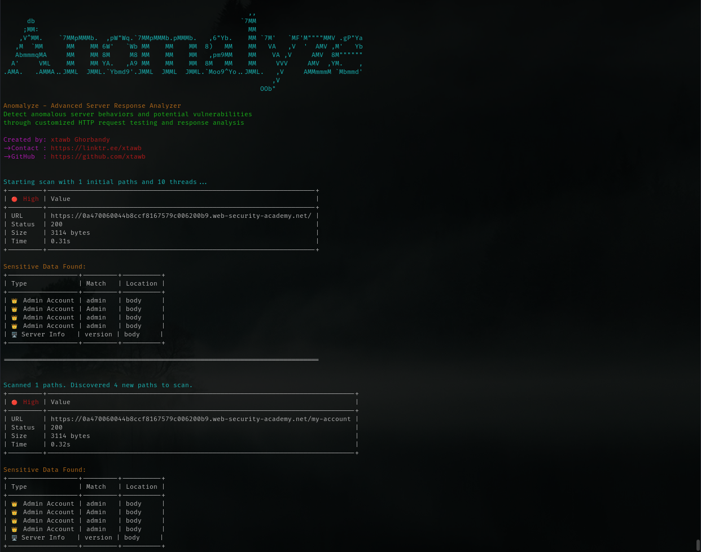

# Advanced Usage Guide for Anomalyze 🛠️

  
*Unlocking Anomalyze's Full Potential*

## Table of Contents
1. [Stealth Scanning Techniques](#stealth-scanning-techniques)
2. [Custom Request Manipulation](#custom-request-manipulation)
3. [Session Management](#session-management)
4. [Rate Limit Evasion](#rate-limit-evasion)
5. [API Scanning](#api-scanning)
6. [Integration with Other Tools](#integration-with-other-tools)
7. [Debugging & Troubleshooting](#debugging--troubleshooting)

---

## Stealth Scanning Techniques 🕵️

### Randomized Delay Patterns
```bash
python Anomalyze.py -u https://target.com --delay random(500-3000)
```
- **Behavior**: Random delays between 500-3000ms
- **Use Case**: Avoid WAF rate limiting

### Dynamic User-Agent Rotation
```bash
python Anomalyze.py -u https://target.com --user-agent-file agents.txt
```
Sample `agents.txt`:
```text
Mozilla/5.0 (Windows NT 10.0)
Googlebot/2.1
curl/7.68.0
```

### IP Rotation via Proxy Chains
```bash
python Anomalyze.py -u https://target.com --proxy-list proxies.txt
```
Format for `proxies.txt`:
```text
http://proxy1:8080
socks5://proxy2:9050
```

---

## Custom Request Manipulation 🎛️

### Advanced Header Injection
```bash
python Anomalyze.py -u https://target.com \
  -H "X-Forwarded-For: 127.0.0.1" \
  -H "X-Original-URL: /admin" \
  --header-file custom_headers.json
```

Example `custom_headers.json`:
```json
{
  "Cache-Control": "no-cache",
  "X-Custom-Version": "1.2.0"
}
```

### Request Body Tampering
```bash
python Anomalyze.py -u https://api.target.com -m PUT \
  --data '{"status":"modified"}' \
  --content-type "application/json-patch+json"
```

### Parameter Pollution
```bash
python Anomalyze.py -u https://target.com \
  --params "id=1" --params "id=2" --params "id=3"
```

---

## Session Management 🔐

### Cookie Persistence
```bash
python Anomalyze.py -u https://target.com \
  --cookie "session=abc123" --save-cookies cookies.txt
```

### OAuth2 Token Handling
```bash
python Anomalyze.py -u https://api.target.com \
  --auth-token "Bearer xyz789" --token-refresh-url "https://auth.target.com/refresh"
```

---

## Rate Limit Evasion ⏱️

### Adaptive Throttling
```bash
python Anomalyze.py -u https://target.com \
  --adaptive-throttle 429:5s,403:10m
```
- **Logic**: If 429 received, pause for 5s; if 403, wait 10min

### IP Rotation Strategy
```bash
python Anomalyze.py -u https://target.com \
  --proxy-rotation 10:3
```
- **Behavior**: Rotate proxy every 10 requests with 3s delay

---

## API Scanning 📡

### OpenAPI/Swagger Enumeration
```bash
python Anomalyze.py -u https://api.target.com \
  --swagger-locations /v2,/v3,/swagger.json
```

### GraphQL Introspection
```bash
python Anomalyze.py -u https://api.target.com/graphql \
  --graphql --query-file queries.gql
```

---

## Integration with Other Tools 🔗

### Burp Suite Integration
```bash
python Anomalyze.py -u https://target.com -o json \
  | python utils/burp_importer.py
```

### Nuclei Template Generation
```bash
python Anomalyze.py -u https://target.com \
  --generate-nuclei-templates
```

---

## Debugging & Troubleshooting 🐛

### Verbose Debug Mode
```bash
python Anomalyze.py -u https://target.com -vvv \
  --debug-log scan_debug.log
```

### Network Capture
```bash
python Anomalyze.py -u https://target.com \
  --pcap-dump scan_traffic.pcap
```

### Memory Profiling
```bash
python -m memory_profiler Anomalyze.py -u https://target.com
```

---

## Pro Tips 💡

1. **Combine with FFUF**:
   ```bash
   python Anomalyze.py -u https://target.com --discovered-paths \
     | ffuf -w - -u https://target.com/FUZZ
   ```

2. **Schedule Scans**:
   ```bash
   watch -n 3600 "python Anomalyze.py -u https://target.com -o json >> scan.log"
   ```

3. **Geo-Targeted Scanning**:
   ```bash
   python Anomalyze.py -u https://target.com \
     --geo-proxy us:5,eu:3,asia:2
   ```

---

> **⚠️ Important**: These advanced techniques may trigger security systems. Always obtain proper authorization before use.  
> **📚 Documentation**: For complete parameter reference, visit [Anomalyze Docs](https://anomalyze.rtfd.io)
