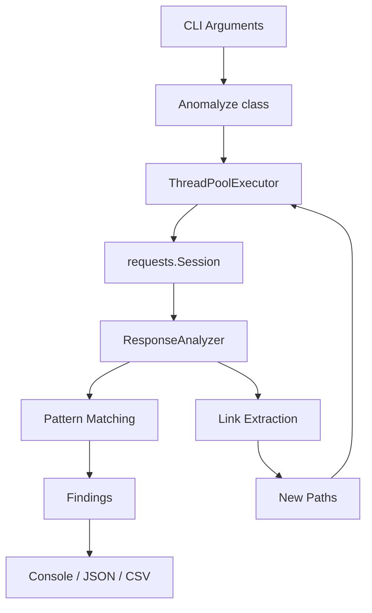
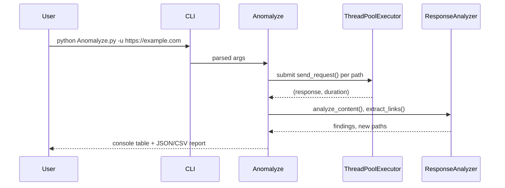

# Anomalyze Architecture Overview 🏗️

Anomalyze is a single-file Python CLI tool (`Anomalyze.py`). There is no
plugin system, module loader, or network daemon — everything below happens
in one process, in one script.



## Table of Contents
1. [Core Components](#core-components)
2. [Data Flow](#data-flow)
3. [Concurrency Model](#concurrency-model)
4. [Detection Patterns](#detection-patterns)
5. [Safety Limits](#safety-limits)
6. [Extending Anomalyze](#extending-anomalyze)

---

## Core Components

### 1. CLI Parser (`build_parser`)
Defines every supported flag with `argparse`, including type validation for
numeric options (`positive_int`, `delay_ms`).

### 2. `Anomalyze` class
Owns one scan run: builds the request session, headers, and path queue from
the parsed arguments, then drives the scan loop and writes reports.

### 3. `ResponseAnalyzer` class
Stateless response inspection: matches compiled regex patterns against
response headers/body, and extracts same-host links for `--deep-scan`.

---

## Data Flow



### Key Data Structures

**Result object** (one per scanned URL, this is what gets written to
JSON/CSV):
```python
{
    "url": str,
    "status": int,
    "size": int,
    "time": str,       # e.g. "0.45s"
    "severity": str,   # Info | Low | Medium | High | Critical
    "findings": [
        {"type": str, "match": str, "location": str}  # location: "body" or "header:<Name>"
    ],
}
```

**Path queue entries** are `(path, depth)` tuples. `depth` starts at 0 for
paths supplied on the command line, the default list, or `--paths-file`, and
increases by 1 for every hop `--deep-scan` follows, capped by `--max-depth`.

---

## Concurrency Model

- Requests for the current batch (up to 100 paths) run concurrently across
  `-t/--threads` worker threads via `concurrent.futures.ThreadPoolExecutor`.
- **All shared state** (`discovered_paths`, `paths`, `results`) is only
  mutated from the main thread, inside the `as_completed()` loop — worker
  threads only perform the HTTP request and return `(response, duration)`.
  This avoids needing locks around the scan state.
- New paths discovered mid-scan are appended to the queue and picked up in
  the next 100-path batch.

---

## Detection Patterns

Patterns live in `patterns.json` next to the script, grouped by severity:

```json
{
  "Critical": [
    ["\\b(password|passwd|pwd|credential)\\b", "🔒 Sensitive Credential"]
  ]
}
```

`ResponseAnalyzer` compiles every pattern once at startup
(`_compile_patterns`) and reuses the compiled `re.Pattern` objects for every
response. Header values and response bodies are matched separately; header
*names* are never matched against patterns, since that would flag routine
headers like `Server` or `Authorization` on nearly every response. Use
`--patterns-file` to load your own pattern set instead.

---

## Safety Limits

- Bodies larger than 5MB, or responses whose `Content-Type` isn't
  text/JSON/XML/JavaScript/HTML, skip pattern analysis and link extraction.
- `--deep-scan` is opt-in and bounded by `--max-depth`; without it, Anomalyze
  never follows links, even on a 200 response.
- A hard cap of 1000 scanned paths per run stops runaway crawls.
- `Ctrl+C` stops the scan loop and still writes out whatever results were
  collected so far.

---

## Extending Anomalyze

There's no plugin API — the practical extension points are:

- **`patterns.json` / `--patterns-file`**: add or replace detection rules
  without touching code.
- **`DEFAULT_PATHS`** in `Anomalyze.py`: adjust the built-in path list, or
  use `--paths-file` for a large wordlist instead.
- **`ResponseAnalyzer.extract_links`**: the place to add support for
  additional link sources (e.g. `sitemap.xml`, `robots.txt`) if needed.
