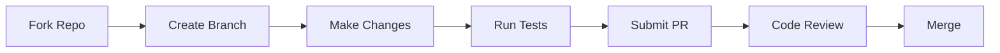

# Contributing to Anomalyze 🤝



## Table of Contents
1. [Ways to Contribute](#ways-to-contribute)
2. [Development Setup](#development-setup)
3. [Coding Standards](#coding-standards)
4. [Testing Guidelines](#testing-guidelines)
5. [Pull Request Process](#pull-request-process)
6. [Code Review Criteria](#code-review-criteria)
7. [Community Guidelines](#community-guidelines)

---

## Ways to Contribute

### 1. Code Contributions
- Implement new detection modules
- Improve scanning algorithms
- Add output formatters (SARIF, HTML, etc.)

### 2. Documentation
- Write tutorials/guides
- Improve inline code docs
- Translate documentation

### 3. Testing & Reporting
- Submit bug reports
- Add test cases
- Verify fixes

### 4. Community Support
- Help triage issues
- Answer forum questions
- Write blog posts

---

## Development Setup

### Prerequisites
- Python 3.8+
- Git
- Poetry (dependency management)

### Installation
```bash
# Fork and clone
git clone https://github.com/YOUR_USERNAME/Anomalyze.git
cd Anomalyze

# Setup environment
poetry install
poetry shell

# Install pre-commit hooks
pre-commit install
```

### Project Structure
```
anomalyze/
├── core/           # Main engine components
├── modules/        # Scanning modules
├── utils/          # Helper functions
├── tests/          # Test suites
└── docs/           # Documentation
```

---

## Coding Standards

### 1. Style Guidelines
- Follow **PEP 8** conventions
- Use **Google-style docstrings**
- Type hints for all functions
- 88-character line limit

### 2. Security Practices
- Never hardcode credentials
- Validate all user inputs
- Use `ssl_context` for HTTPS

### 3. Module Development
```python
class CustomModule(BaseModule):
    """One-line description of module"""
    
    def setup(self):
        """Initialize resources"""
        self.pattern = re.compile(r'sample')
    
    def process_response(self, response):
        """Analyze response and return findings"""
        findings = []
        if self.pattern.search(response.text):
            findings.append(Finding(
                type="Sample Detection",
                severity="Medium"
            ))
        return findings
```

---

## Testing Guidelines

### Test Types
| Test Type | Location | Coverage Target |
|-----------|----------|-----------------|
| Unit Tests | `tests/unit` | 90%+ |
| Integration | `tests/integration` | Critical paths |
| Performance | `tests/benchmark` | Key operations |

### Running Tests
```bash
# Run all tests
pytest --cov=anomalyze

# Run specific test
pytest tests/unit/test_scanner.py -v

# Generate coverage report
pytest --cov-report html
```

### Writing New Tests
```python
def test_admin_page_detection():
    scanner = Scanner()
    result = scanner.check_path("/admin")
    assert result.status == 403
    assert "Admin" in result.findings[0].type
```

---

## Pull Request Process

1. **Branch Naming**:
   ```
   feature/add-sql-detection
   fix/issue-123
   docs/update-contributing
   ```

2. **Commit Message Format**:
   ```bash
   git commit -m "feat: add GraphQL support [ANOM-101]"
   ```
   Prefix options: `feat`, `fix`, `docs`, `style`, `refactor`, `test`, `chore`

3. **PR Checklist**:
   - [ ] Tests pass
   - [ ] Documentation updated
   - [ ] No breaking changes
   - [ ] Signed-off-by (DCO)

---

## Code Review Criteria

### What We Look For
✅ **Functionality**  
✅ **Code Quality**  
✅ **Test Coverage**  
✅ **Security Impact**  
✅ **Performance**  

### Review Process
1. Automated checks (CI/CD)
2. Maintainer review (48h SLA)
3. Optional security review for critical changes

---

## Community Guidelines

### Communication Channels
- **GitHub Issues**: Bug reports and feature requests
- **Discord**: Real-time discussions
- **Monthly Meetups**: Virtual contributor syncs

### Code of Conduct
All contributors must follow our [Code of Conduct](CODE_OF_CONDUCT.md). Key points:
- Be respectful
- Welcome newcomers
- Credit all contributions

---

## Recognition

### Contributor Tiers
| Tier | Requirements | Benefits |
|------|-------------|----------|
| **Member** | 1 merged PR | Discord role |
| **Maintainer** | 5+ PRs | Review privileges |
| **Core Team** | Sustained contribution | Commit access |

### Hall of Fame
See our [Contributors Wall](https://github.com/xtawb/Anomalyze/graphs/contributors)!

---

> 💡 First time contributing? Check out our [Good First Issues](https://github.com/xtawb/Anomalyze/contribute)  
> 🛠️ Need help? Join our [Discord](https://discord.gg/UMExDCTp9f)  
> 📅 Weekly contributor office hours: Thursdays 3PM UTC
