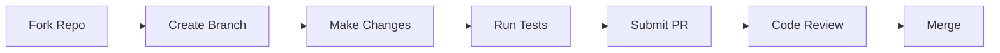

# Contributing to Anomalyze 🤝


```mermaid
graph LR
    A[Fork Repo] --> B[Create Branch]
    B --> C[Make Changes]
    C --> D[Run Tests]
    D --> E[Submit PR]
    E --> F[Code Review]
    F --> G[Merge]
```

## Table of Contents
1. [Ways to Contribute](#ways-to-contribute)
2. [Development Setup](#development-setup)
3. [Project Structure](#project-structure)
4. [Coding Standards](#coding-standards)
5. [Testing](#testing)
6. [Pull Request Process](#pull-request-process)
7. [Code of Conduct](#code-of-conduct)

---

## Ways to Contribute

- **Code**: new detection patterns, bug fixes, new CLI options.
- **Documentation**: fix inaccuracies, add examples, improve clarity.
- **Testing**: report bugs via [GitHub Issues](https://github.com/xtawb/Anomalyze/issues),
  add test cases to `tests/test_anomalyze.py`.

---

## Development Setup

### Prerequisites
- Python 3.8+
- Git

### Installation
```bash
git clone https://github.com/YOUR_USERNAME/Anomalyze.git
cd Anomalyze
python -m venv venv
source venv/bin/activate  # Windows: venv\Scripts\activate
pip install -r requirements-dev.txt
```

`requirements-dev.txt` installs the runtime dependencies plus `pytest` for
running the test suite.

---

## Project Structure

```
Anomalyze/
├── Anomalyze.py          # The entire tool
├── patterns.json         # Default sensitive-data detection patterns
├── requirements.txt       # Runtime dependencies
├── requirements-dev.txt   # Runtime + test dependencies
├── tests/
│   └── test_anomalyze.py # Unit tests (pytest)
└── docs/                  # This documentation site (mkdocs)
```

There's no separate `core/`, `modules/`, or `utils/` package — Anomalyze is
intentionally a single script, so keep contributions consistent with that
(see [Architecture](architecture.md) for how the pieces fit together).

---

## Coding Standards

- Follow PEP 8.
- Add type hints where practical.
- Keep functions and methods focused; avoid adding new abstractions unless a
  feature genuinely needs them.
- Don't add speculative flags or options that don't do anything yet — every
  documented option should map to real, working behavior.

---

## Testing

```bash
# Run the full test suite
pytest tests/ -v

# Run a single test
pytest tests/test_anomalyze.py::TestResponseAnalyzer -v
```

New features and bug fixes should come with a test in
`tests/test_anomalyze.py`. Tests import `Anomalyze.py` directly as a module,
so no separate package build is required.

---

## Pull Request Process

1. **Branch naming**: `feature/add-x`, `fix/issue-123`, `docs/update-y`.
2. **Before opening a PR**:
   - `pytest tests/ -v` passes.
   - `python -m py_compile Anomalyze.py` succeeds.
   - Documentation updated for any user-facing change (README.md,
     `docs/usage.md`, `docs/advanced_options.md` as relevant).
3. Open a PR against `main` describing what changed and why.

---

## Code of Conduct

All contributors are expected to follow the
[Code of Conduct](CODE_OF_CONDUCT.md).
