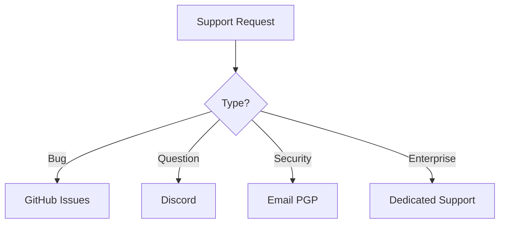

# Anomalyze Support Guide 🛠️



## Table of Contents
1. [Community Support](#community-support)
2. [Troubleshooting Guide](#troubleshooting-guide)
3. [Frequently Asked Questions](#frequently-asked-questions)
4. [Security Vulnerabilities](#security-vulnerabilities)
5. [Feature Requests](#feature-requests)

---

## Community Support

### 1. GitHub Discussions
- **Best for**: How-to questions and ideas
- **Response Time**: 24-48 hours
- **Link**: [Anomalyze Discussions](https://github.com/xtawb/Anomalyze/discussions)

### 2. Discord Community
```bash
# Join our server
https://discord.gg/UMExDCTp9f
```
**Channels**:
- `#general` - Basic usage help
- `#showcase` - Share your scans
- `#development` - Contributor chat

### 3. Stack Overflow
- Use tag `[anomalyze]`
- Active maintainers monitor posts

---

## Troubleshooting Guide

### Common Issues

#### 1. Installation Problems
**Symptoms**:
- `ModuleNotFoundError`
- SSL errors during install

**Solution**:
```bash
# Recreate virtual environment
python -m venv --clear .venv
source .venv/bin/activate
pip install --upgrade pip setuptools wheel
pip install -r requirements.txt
```

#### 2. Scan Freezes
**Debug steps**:
1. Check thread dump:
   ```bash
   python Anomalyze.py --thread-dump
   ```
2. Limit memory usage:
   ```bash
   python Anomalyze.py --max-memory 2GB
   ```

#### 3. False Positives
```bash
# Exclude specific pattern
python Anomalyze.py --exclude-pattern "api_key=\d{5}"
```

---

## Frequently Asked Questions

### Q1: How to scan authenticated sites?
```bash
python Anomalyze.py -u https://example.com \
  --cookie "session=abc123" \
  --login-url https://example.com/login \
  --login-data "user=admin&pass=secret"
```

### Q2: Difference between --deep-scan and --recursive?
- `--deep-scan`: Follows links in HTML
- `--recursive`: Tests path permutations (e.g., /api/v1, /api/v2)

### Q3: Legal considerations?
```text
1. Always obtain written permission
2. Use --legal-mode to:
   - Add disclosure header
   - Limit request rate
   - Anonymize logs
```

---

## Security Vulnerabilities

### Responsible Disclosure
- 90-day disclosure policy
- CVE assignment for valid reports
- Hall of Fame for researchers

---

## Feature Requests

### Submission Guidelines
1. Check existing [issues](https://github.com/xtawb/Anomalyze/issues)


### Voting System
- 👍 = Need this
- 🎉 = Nice-to-have
- ❤️ = Critical feature


---

## Support SLA Summary

| Channel | Response Time | Hours | Best For |
|---------|--------------|-------|----------|
| GitHub Issues | 48h | 24/7 | Bugs |
| Discord | 2h | 08-22 UTC | Quick help |
| Email | 24h | Business hours | Sensitive issues |


