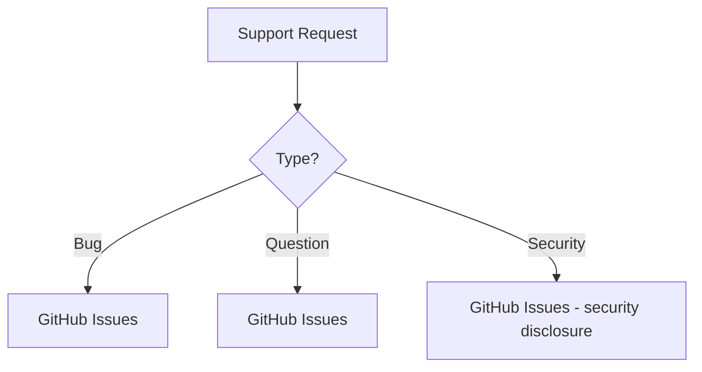

# Anomalyze Support Guide 🛠️


```mermaid
graph TD
    A[Support Request] --> B{Type?}
    B -->|Bug| C[GitHub Issues]
    B -->|Question| D[GitHub Issues]
    B -->|Security| E[GitHub Issues - security disclosure]
```

## Table of Contents
1. [Getting Help](#getting-help)
2. [Troubleshooting Guide](#troubleshooting-guide)
3. [Frequently Asked Questions](#frequently-asked-questions)
4. [Reporting Security Issues](#reporting-security-issues)
5. [Feature Requests](#feature-requests)

---

## Getting Help

- **Bug reports and questions**: [GitHub Issues](https://github.com/xtawb/Anomalyze/issues)
- **Contact**: [linktr.ee/xtawb](https://linktr.ee/xtawb)
- **Documentation**: [anomalyze.readthedocs.io](https://anomalyze.readthedocs.io)

---

## Troubleshooting Guide

### `ModuleNotFoundError` on startup
Your dependencies aren't installed, or you're not in the right environment:
```bash
python -m venv venv
source venv/bin/activate  # Windows: venv\Scripts\activate
pip install -r requirements.txt
```

### `ThreadPoolExecutor` / thread-count errors
`-t/--threads` must be 1 or higher; the CLI rejects `0` or negative values
with a clear error instead of crashing mid-scan.

### TLS / certificate errors against a lab target
Use `-k/--insecure` to skip certificate verification for self-signed certs
in a test environment. Never use it against production targets you don't
control.

### Too many low-value findings
Raise the noise floor:
```bash
python Anomalyze.py -u https://example.com --min-severity Medium
```

### Scan seems to hang
- Check `-v/--verbose` for connection/timeout errors.
- Lower `-t/--threads` or raise `--timeout` if the target is slow or rate
  limiting you.
- `--deep-scan` without `--max-depth` still defaults to depth 2, but a very
  link-heavy site can still take a while — the 1000-path hard cap will stop
  it eventually.

---

## Frequently Asked Questions

**Q: How is this different from dirbuster/gobuster?**
A: Anomalyze goes beyond simple directory brute-forcing by analyzing
responses for sensitive data and (with `--deep-scan`) automatically
discovering new paths from links in the response.

**Q: Is this tool safe to run on production systems?**
A: Always get proper authorization before scanning any system you don't own.
Use `-t`, `--delay`, and `--timeout` to control request volume and stay
within what your authorization allows.

**Q: Can I extend the pattern matching?**
A: Yes — edit `patterns.json` in place, or pass `--patterns-file` with your
own JSON file. See [Custom Detection Patterns](advanced_options.md#custom-detection-patterns).

**Q: How do I scan an authenticated area of a site?**
A: Use `--cookie "session=..."` or `-H "Authorization: Bearer ..."` with a
token/cookie you're authorized to use for testing.

---

## Reporting Security Issues

If you find a vulnerability in Anomalyze itself (not a target you scanned
with it), please open a [GitHub Issue](https://github.com/xtawb/Anomalyze/issues)
or reach out via [linktr.ee/xtawb](https://linktr.ee/xtawb) rather than
disclosing it publicly first.

---

## Feature Requests

Check [existing issues](https://github.com/xtawb/Anomalyze/issues) before
opening a new one, and describe the concrete use case the feature would
unblock.
